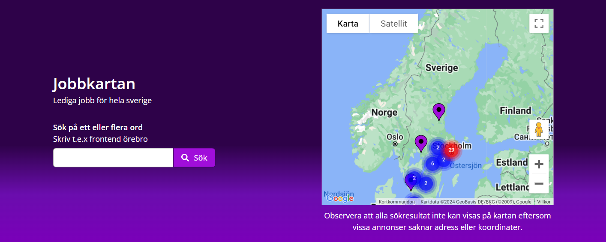
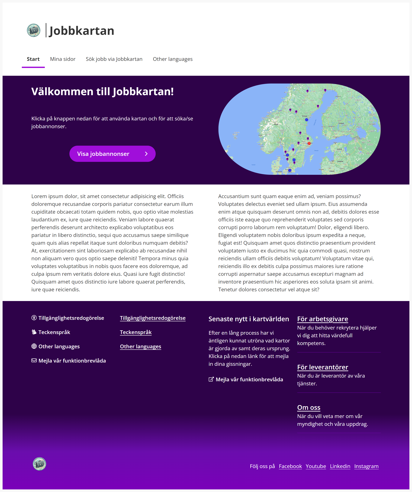
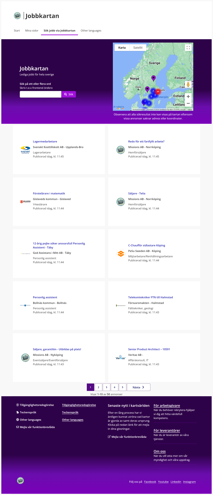
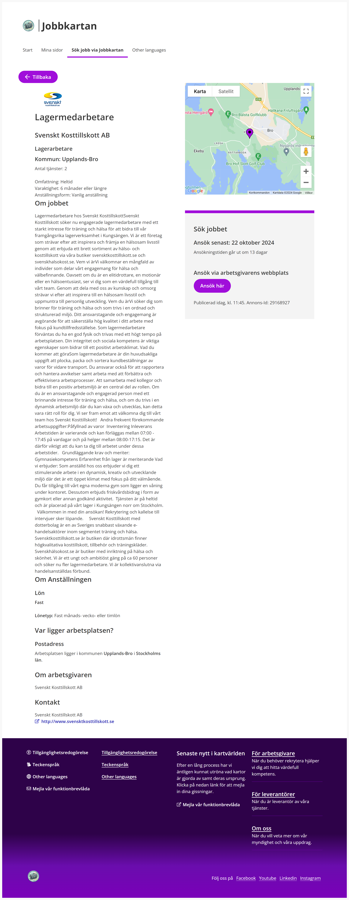

# Group Assignment - JobbKartan

Course: Javascript - Advanced

## Screenshots

The Search Header includes a search input for entering keywords and a map that visually displays job listings across Sweden. Users can search for jobs and see where they are located on the map.

The Start Page welcomes users to JobbKartan, providing a simple and intuitive layout that leads to various sections of the application.

The Job Page shows a list of job listings, allowing users to explore available positions and find relevant opportunities.

The Job Info page provides detailed information about a specific job listing, including company details, job requirements, and application instructions.

## About this project

JobbKartan is a web application designed to make job searching more interactive and visually engaging. By displaying job listings on a map, users can easily explore employment opportunities across Sweden based on location. The platform allows for keyword searches, providing relevant job postings that can be viewed in detail with a simple click. With a focus on a responsive and user-friendly interface, JobbKartan makes finding your next job easier and more intuitive.

## Tech stack

- HTML5
- CSS
- React
- React-Router
- TypeScript
- Vite
- ESLint
- Arbetsförmedlingens designsystem

## Start the project

npm i
npm run dev

## Authors

- [@Annika-Nyholm](https://www.github.com/Annika-Nyholm)
- [@CarolineVarsaga](https://www.github.com/CarolineVarsaga)
- [@Aanndreas](https://www.github.com/Aanndreas)
- [@oscarkannerstedt](https://www.github.com/oscarkannerstedt)

# Case AF

Denna uppgift består av att ni behöver skapa er egna platsbank. Ni får lägga till precis den funktionalitet som ni själva tycker skall finnas med i denna applikation. För fler detaljer se pdf-filen som är bifogad till uppgiften på itslearning
